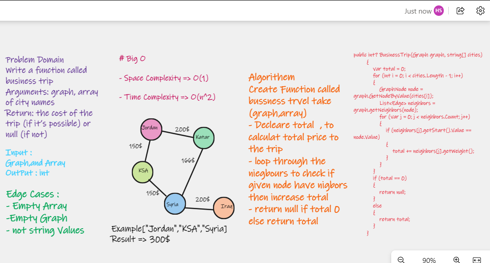

# Problem Domain

Write a function called business trip
- Arguments: graph, array of city names
- Return: the cost of the trip (if it’s possible) or null (if not)

#  Whiteboard Process

# API

- Arguments: graph, array of city names
- Return:the cost of the trip.

# Big O

- Space Complexity => O(1)

- Time Complexity => O(n^2)
