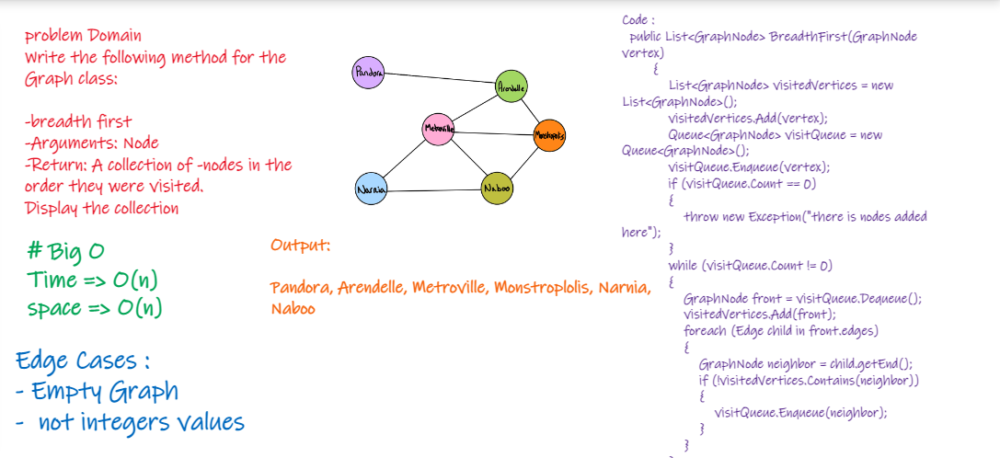

# Problem Domain

Implement a breath first traversal on a graph

#  Whiteboard Process

# API

-  breadth first
- Arguments: Node
- Return: A collection of nodes in the order they were visited.
- Display the collection
# Big O

- Space Complexity => O(n)

- Time Complexity => O(n)
