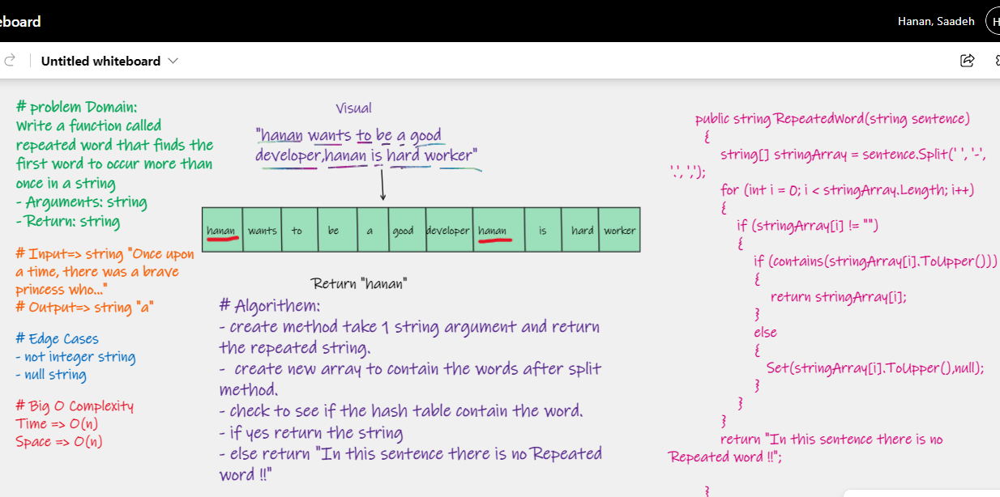

# Challenge Summary

Write a function called repeated word that finds the first word to occur more than once in a string

- Arguments: string
- Return: string
## Whiteboard Process

## Approach & Efficiency

- Write a function called repeated word

- declare array of string

- split string by { ' ', ',', '.','-'}

- loop through this array

- if the hash table contain the string return the string. 

Big O Complexity :  

Time =>  O(n)  
Space => O(n) 

