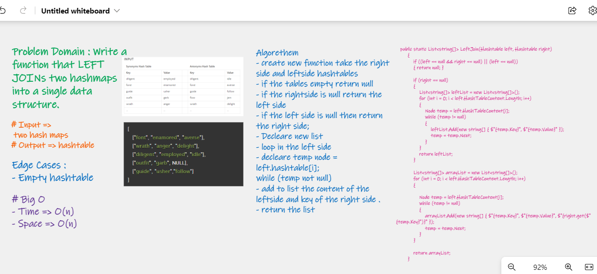

# hashmap-left-join

## Challenge

LEFT JOIN method returns all rows from the left table, even if there are no matches in the right table. This means that if the ON clause matches 0 (zero) records in the right table; the join will still return a row in the result, but with NULL in each column from the right table.  

This means that a left join returns all the values from the left table, plus matched values from the right table or NULL in case of no matching join predicate. 

# WhiteBoard

## Approach & Efficiency

Write a function that LEFT JOINs two hashmaps into a single data structure.

- Write a function called left join  
- Arguments: two hash maps  
- The first parameter is a hashmap that has word strings as keys, and a synonym of the key as values.  
- The second parameter is a hashmap that has word strings as keys, and antonyms of the key as values.  
- Return: The returned data structure that holds the results is up to you. It doesn’t need to exactly match the output below, so long as it achieves the LEFT JOIN logic  

