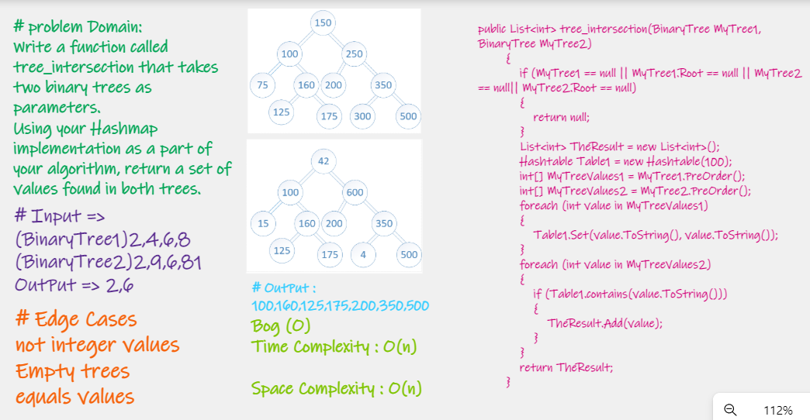

# Challenge Summary
Write a function called tree_intersection that takes two binary trees as parameters.
Using your Hashmap implementation as a part of your algorithm, return a set of values found in both trees.


# Whiteboard Process


# Approach & Efficiency
Complexity:  
- Space -> O(n);
- Time -> O(n); 

# Solution

```
public List<int> tree_intersection(BinaryTree MyTree1, BinaryTree MyTree2)
        {
            if (MyTree1 == null || MyTree1.Root == null || MyTree2 == null|| MyTree2.Root == null)
            {
                return null;
            }
            List<int> TheResult = new List<int>();
            Hashtable Table1 = new Hashtable(100);
            int[] MyTreeValues1 = MyTree1.PreOrder();
            int[] MyTreeValues2 = MyTree2.PreOrder();
            foreach (int value in MyTreeValues1)
            {
                Table1.Set(value.ToString(), value.ToString());
            }
            foreach (int value in MyTreeValues2)
            {
                if (Table1.contains(value.ToString()))
                {
                    TheResult.Add(value);
                }
            }
            return TheResult;
        }
        ```