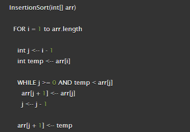
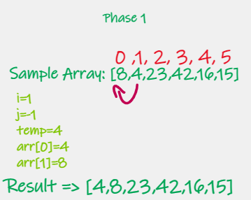

# Insertion Sort
Insertion Sort is an algorithem to sort the element of the array in a sort sequance, from small to larg in efficient  way.

# Pseudo Code

# Trace

Sample Array => [8,4,23,42,16,15]

Pass 1:

In the first pass 8>4 => 8 is greater than 4 so swap 4 and 8 let 4 in the temp, then let the value of the second element in the first index, and finally let the second index = temp. 

Pass 2:

In the second pass 23>8  => 23 is greater than 8 so Don't swap , we do not move the element 23 and the array stays in the same order.

Pass 3:

In the third pass 42>23  => 42 is greater than 23 so Don't swap , we do not move the element 42 and the array stays in the same order.

Pass 4:

In the fourth pass 16<42&23  => 16 is smaller than 42,23 so insert the element 16 into the previous position until 16>8

Pass 5:

In the fifth pass 15<42&23&16  => 15 is smaller than 42,23,16 so insert the element 15 into the previous position until 15>8

# Efficency

Time: O(n^2)

The basic operation of this algorithm is comparison. This will happen n * (n-1) number of times…concluding the algorithm to be n squared.

Space: O(1)

No additional space is being created. This array is being sorted in place…keeping the space at constant O(1).