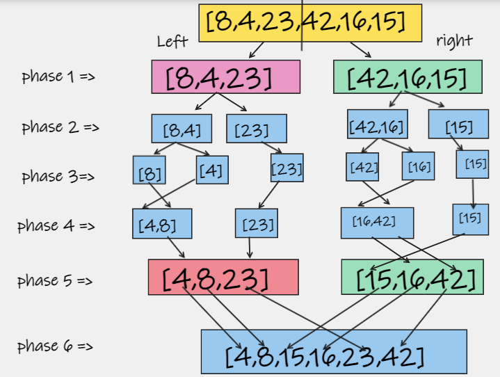
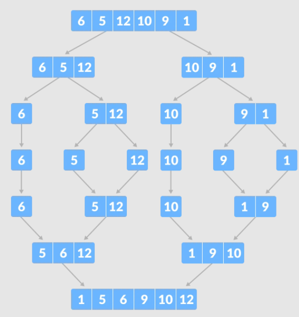
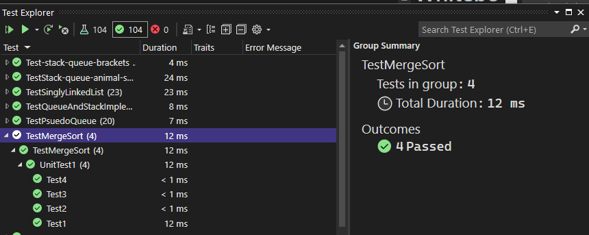

# Merge Sort
Merge sort is a divide-and-conquer algorithm based on the idea of breaking down a list into several sub-lists until each sublist consists of a single element and merging those sublists in a manner that results into a sorted list.

# Pseudo Code
```
ALGORITHM Mergesort(arr)
    DECLARE n <-- arr.length

    if n > 1
      DECLARE mid <-- n/2
      DECLARE left <-- arr[0...mid]
      DECLARE right <-- arr[mid...n]
      // sort the left side
      Mergesort(left)
      // sort the right side
      Mergesort(right)
      // merge the sorted left and right sides together
      Merge(left, right, arr)

ALGORITHM Merge(left, right, arr)
    DECLARE i <-- 0
    DECLARE j <-- 0
    DECLARE k <-- 0

    while i < left.length && j < right.length
        if left[i] <= right[j]
            arr[k] <-- left[i]
            i <-- i + 1
        else
            arr[k] <-- right[j]
            j <-- j + 1

        k <-- k + 1

    if i = left.length
       set remaining entries in arr to remaining values in right
    else
       set remaining entries in arr to remaining values in left
```

# Whiteboard Process




pass 1 => 
[8,4,23,42,16,15]
- left [8,4,23]
- right = [42,16,15]
find the middle , then devide to 2 arrays left and right.

---

pass 2 => 

- left [8,4,23] devided to 
left [8,4]
right [23]
- right = [42,16,15] devided to 
left [42,16]
right [15]

---

pass 3 => 

- left [8,4] devided to
left [8]
right [4]
 
- left [42,16] devided to
left [42]
left[16] 

---

- Now that all instances of left and right arrays only contain 1 value our Merge method begins to compare and sort the number in order Merge(left,right,arr)

---

- Now that each instance of right and left are in order, we compare each unit to the other once again to establish proper order.


# Trace 



# Test


# Efficency

Time: O(n log n)

Space: O(n)

