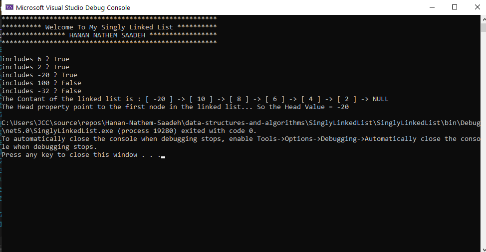
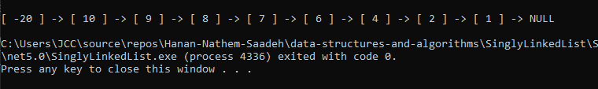
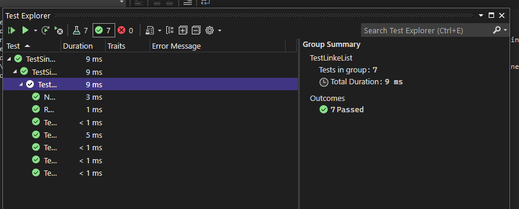

# Singly Linked List
<!-- Short summary or background information -->
A singly linked list is a data structure that represents a sequence of nodes, where each node in the list points to the next node.

A benefit of a linked list is that items can be added and removed from the beggining of the list in constant time (which can be useful for specific applications).

However, a linked list does not provide constant time access to a particiular item (index) within the list, like an array does.

## Challenge (TO DO)
<!-- Description of the challenge -->
- Create a Node class that has properties for the value stored in the Node, and a pointer to the next Node.
- Create a Linked List class , include a head property.
- The class should contain the following methods : Insert,Includes, to string , append,insertBefore , insertAfter , kthFromEnd , ZipMethod
     * Insert : Adds a new node with that value to the head of the list with an O(1) Time performance.
     * Includes : Indicates whether that value exists as a Node’s value somewhere within the list.
     * to string : Returns: a string representing all the values in the Linked List, formatted as: "[ a ] -> [ b ] -> [ c ] -> NULL"
     * Append : adds a new node with the given value to the end of the list.
     * InsertBefore : adds a new node with the given new value immediately before the first node that has the value specified
     * InsertAfter : adds a new node with the given new value immediately after the first node that has the value specified
     * kthFromEnd : takes a key and return the node's value that the key places from the tail of the linked list.
     * ZipMethod : Zip the two linked lists together into one so that the nodes alternate between the two lists and return a reference to the the zipped list.
     * palindrome : function to validate whether or not a Linked list is palindrome.
     

## Whiteboard Process 
[Append - Whiteboard](../../img/1.png)

[InsertBefore - Whiteboard](../../img/2.png)

[InsertAfter - Whiteboard](../../img/3.png)

[kthFromEnd - whiteboard](../../img/kthFromEnd.png)

[ZipMethod - whiteboard](../../img/ZipMethod.png)

[palindrome - whiteboard](../../img/palindrome.png)

## Visual 

### Test Linked List

## Approach & Efficiency
<!-- What approach did you take? Why? What is the Big O space/time for this approach? -->

* LinkedList.Insert ==>  adds a new node, points it to the previous 'Head' as 'Next', and makes it the new 'Head' .
    - Time complexity is O(1).
    - Space complexity is O(1) .
* LinkedList.Includes == > starts at 'Head' and compares the passed-in value to each node in turn.
    - Time complexity is O(n).
    - Space complexity is O(1).
* LinkedList.toString ==> visits each node once, so time complexity is O(n).

* LinkedList.Append ==> visits each node once, so time complexity is O(n).

* LinkedList.InsertBefore ==> visits each node once, so time complexity is O(n).

* LinkedList.InsertAfter ==> visits each node once, so time complexity is O(n).

* LinkedList.kthFromEnd(k) ==> O(n)

* List.ZipList(list1,list2) ==> O(n)

* palindrome (list) ==> O(n)

