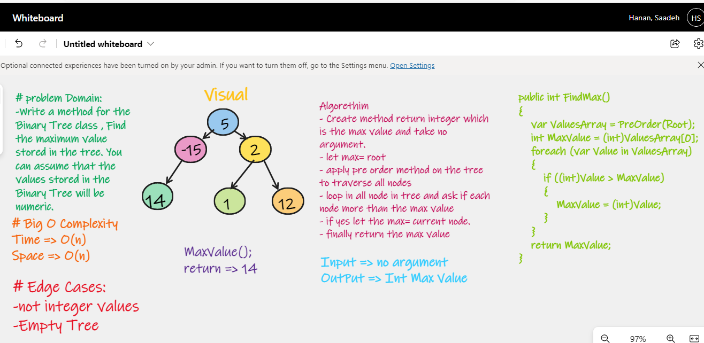


# Find the Maximum Value in a Binary Tree

# Code Challenge: Class 16

# Challenge Summary
Write the following method for the Binary Tree class

- find maximum value
- Arguments: none
- Returns: number
- Find the maximum value stored in the tree. You can assume that the values stored in the Binary Tree will be numeric.

# Whiteboard Process

# Approach & Efficiency

Time: O(n) 
Space: O(h) 

