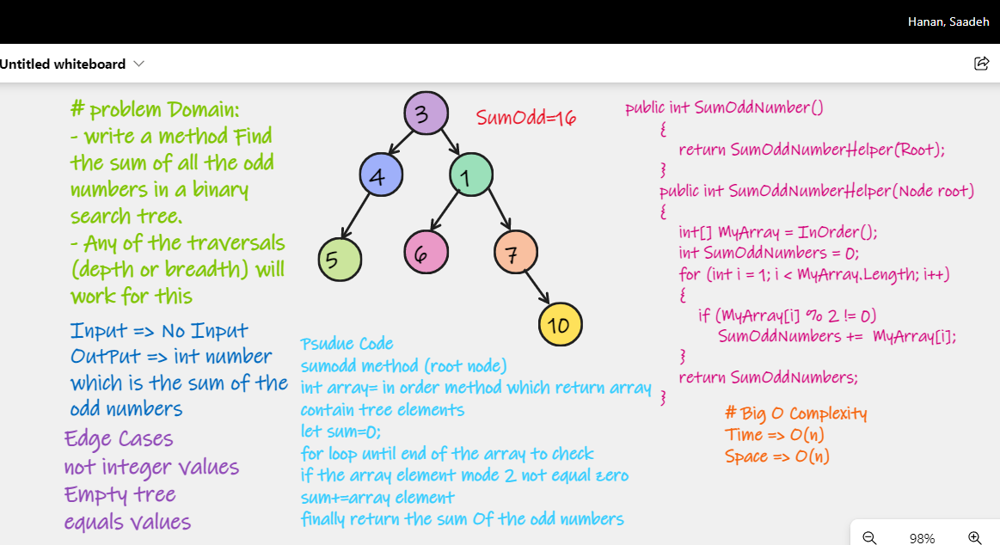

# Find the sum of odd numbers in BST. 

# Challenge Summary
Write A method to Find the sum of all the odd numbers in a binary search tree. 

# Whiteboard Process

# Approach & Efficiency
The Big O of time: O(n)

The Big O of space: O(n)
