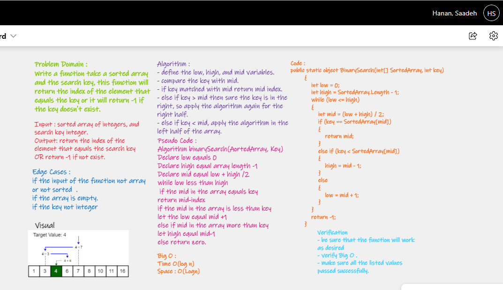

# Binary Search of Sorted Array
## To Do

Write a function called BinarySearch which takes in 2 parameters: a sorted array and the search key. and Without using  any of the built-in methods available in c# , its  return the index of the array’s element that is equal to the value of the search key, or -1 if the element is not in the array.
---

## Whiteboard Process

## Approach & Efficiency

* The algorithm follows the Divide & Conquer approach.

* In The (BinarySearch) function  I try to use binary search tree concepts and divide array to half and find the element that user want.

- define the low, high, and mid variables. 
- compare the key with mid.
- if key matched with mid return mid index.
- else if key > mid then sure the key is in the right, so apply the algorithm again for the right half.
- else if key < mid, apply the algorithm in the left half of the array.

### Big O represents the complexity of a function that increases linearly and in direct proportion to the number of inputs.
space O(Logn)

time O(Logn)

