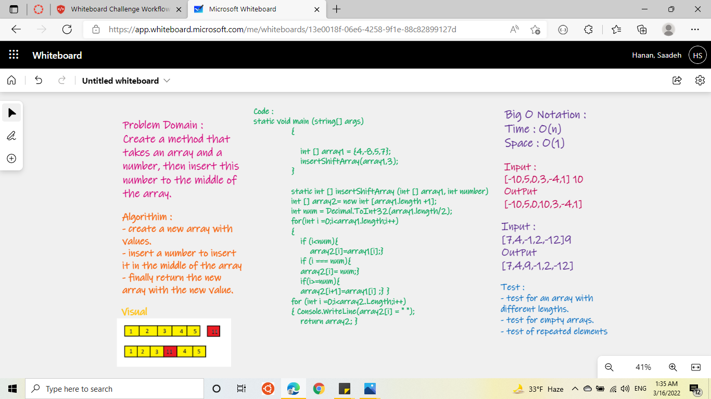

# array insert shift
---

### To Do

Write a function called `insertShiftArray` which takes in an array and a value to be added. Without utilizing any of the built-in methods, return an array with the new value added at the middle index.

- Insert a value at the midpoint of the array.

- Return the modified array with the value added.
---
## Whiteboard Process

---
## Approach & Efficiency

- Create an array that holds and acccepts values.
- Find the midpoint of the array.
- Insert the new value in at the middle of the array
- Append the first half of the array elements + the value + the second half of the array elements
- Return the modified string.
---
Big O represents the complexity of a function that increases linearly and in direct proportion to the number of inputs.

space O(n)

time O(n)
