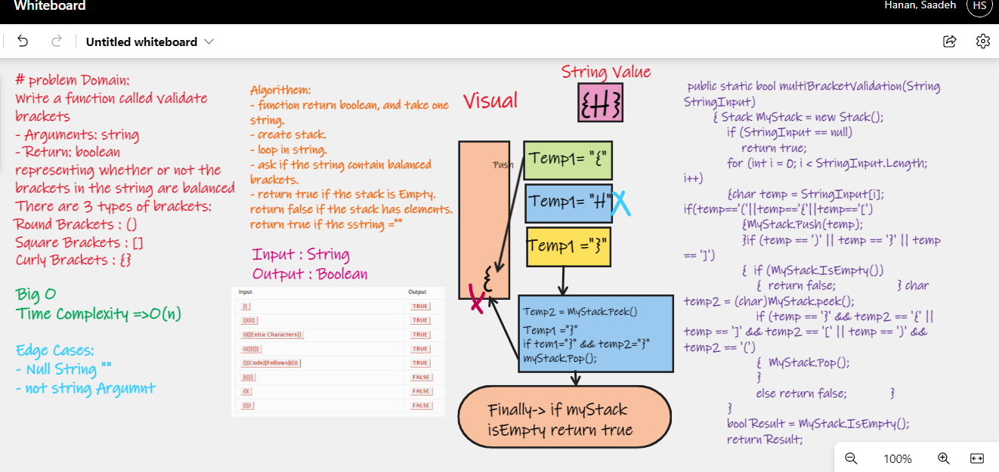

# Multi-bracket Validation

## Challenge Summary
Write a function which accepts a string containing a pattern of brackets and returns true if the pattern of brackets is correct. Otherwise it returns false.
- Your function should take a string as its only argument.
- should return a boolean representing whether or not the brackets in the string are balanced.

**There are 3 types of brackets:**

- Round Brackets : ()
- Square Brackets : []
- Curly Brackets : {}

# Whiteboard Process

# Approach & Efficiency
Time Complexity  O(n)

# Test

