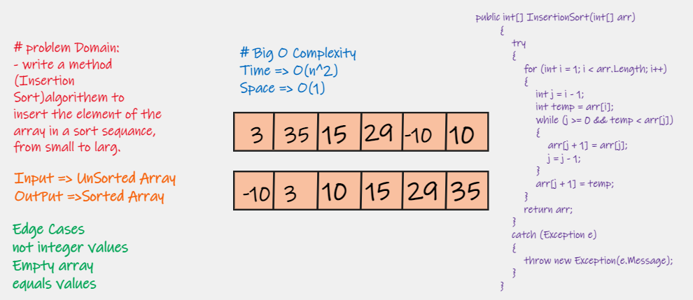

# Challenge Summary

Insertion Sort is an algorithem to sort the element of the array in a sort sequance, from small to larg in efficient  way.

## Whiteboard Process

## Approach & Efficiency

### Big O Complexity

Time => O(n)

Space => O(n)
