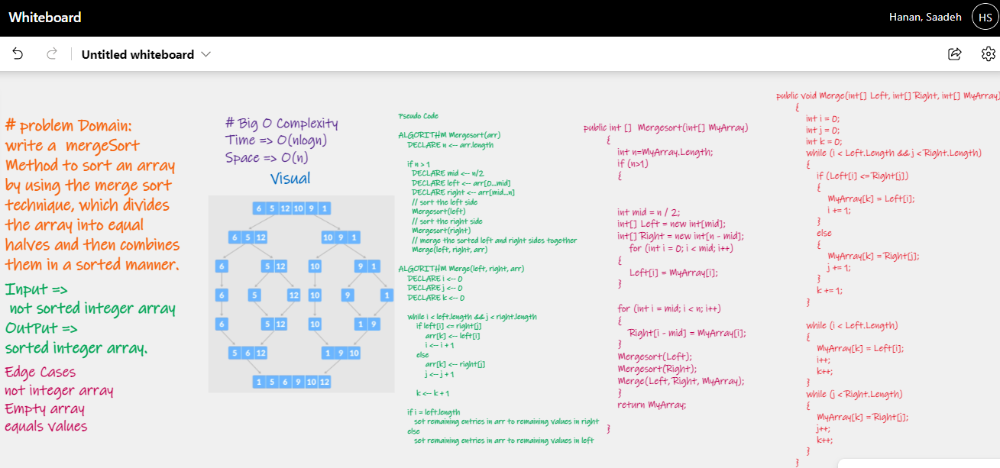
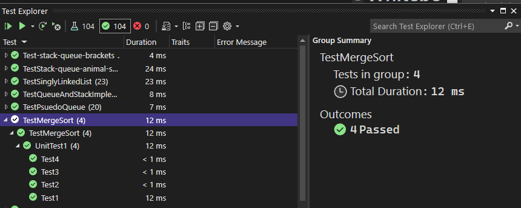

Challenge Summary

write a Merge sort method which is a divide-and-conquer algorithm based on the idea of breaking down a list into several sub-lists until each sublist consists of a single element and merging those sublists in a manner that results into a sorted list.

# Whiteboard Process

# Test

# Efficency

Time: O(n log n)

Space: O(n)

