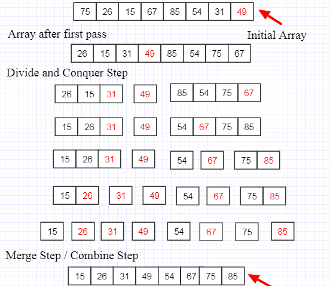

#  Quick Sort

QuickSort is a Divide and Conquer algorithm. It picks an element as pivot and partitions the given array around the picked pivot. There are many different versions of quickSort that pick pivot in different ways. 

Always pick first element as pivot.  
Always pick last element as pivot (implemented below)  
Pick a random element as pivot. 
Pick median as pivot.  

# Algorithm

- SELECT a pivot point. (Our implementation selects the last number in the collection)  
- REORDER the collection such that all values less than the pivot are before the pivot, and all values greater than the pivot are after it.  
- RECURSIVE CONTINUE: Return to Step 1, selecting a new pivot in each of the divided higher and lower sections, until the array is sorted.  

# Pseudo Code

```
Pseudo Code
ALGORITHM QuickSort(arr, left, right)
    if left < right
        // Partition the array by setting the position of the pivot value
        DEFINE position <-- Partition(arr, left, right)
        // Sort the left
        QuickSort(arr, left, position - 1)
        // Sort the right
        QuickSort(arr, position + 1, right)

ALGORITHM Partition(arr, left, right)
    // set a pivot value as a point of reference
    DEFINE pivot <-- arr[right]
    // create a variable to track the largest index of numbers lower than the defined pivot
    DEFINE low <-- left - 1
    for i <- left to right do
        if arr[i] <= pivot
            low++
            Swap(arr, i, low)

     // place the value of the pivot location in the middle.
     // all numbers smaller than the pivot are on the left, larger on the right.
     Swap(arr, right, low + 1)
    // return the pivot index point
     return low + 1

ALGORITHM Swap(arr, i, low)
    DEFINE temp;
    temp <-- arr[i]
    arr[i] <-- arr[low]
    arr[low] <-- temp
```


# Trace 



Step 1: Take two elements left first element and right last element

Step 2: let low equal the starting index of the array, low -1

Step 3: let pivot equal the last index of the array

Step 4: Take a variable i and initialize it to left

Step 5: Traverse through the entire array using the variable i and compare each element with pivot

Step 6: If arr[i] <= pivot then increment i and swap element as position i and low, first time swap 49 with 67

Step 7: Increment i by 1

Step 8: swap 67 and 85

Step 9: When the loop terminates, return low + 1.

step 10: The value returned by the partitioning algorithm gives us the correct position or index of the pivot in the array. What is meant by correct position is that all elements preceding the pivot are smaller than the pivot and all the elements after the pivot are greater than it.

# Efficency

Time: O(n log n)

Space: O(n)
