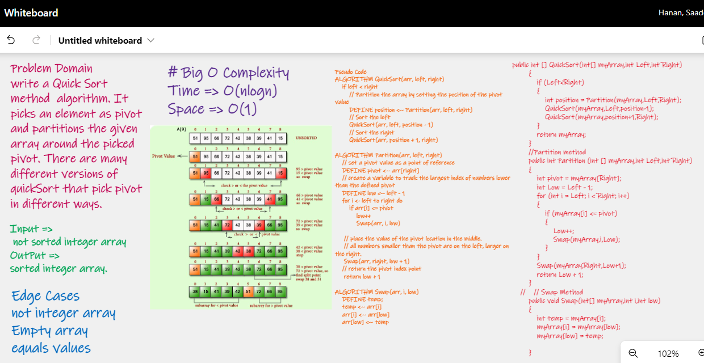

# Problem Domain

Write a Quick Sort method  algorithm. It picks an element as pivot and partitions the given array around the picked pivot. There are many different versions of quickSort that pick pivot in different ways.  

# Whiteboard Process

# Efficency

Time: O(n log n)

Space: O(n)