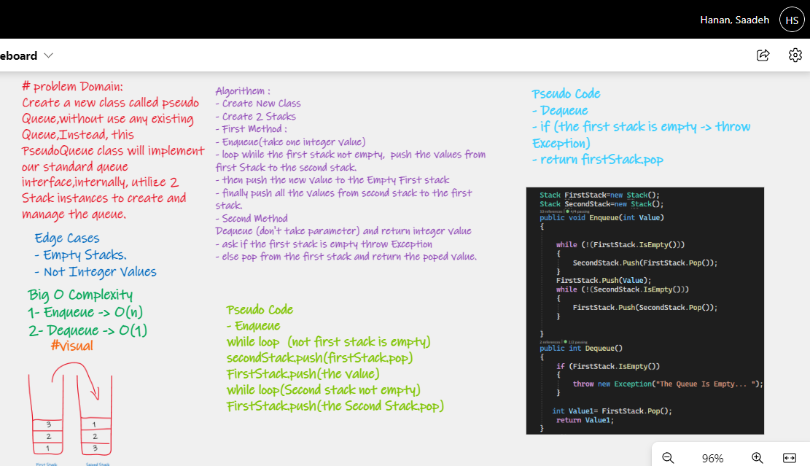
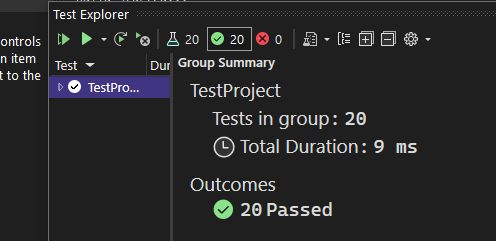

# Challenge Summary

Create a new class called pseudo Queue,without use any existing Queue,Instead, this PseudoQueue class will implement our standard queue interface,internally, utilize 2 Stack instances to create and manage the queue.

# Whiteboard Process

# Approach & Efficiency

***Big O Complexity***

1- Enqueue -> O(n)

2- Dequeue -> O(1)

# Solution

- Unit Test

# API

**Enqueue**

Arguments: value

Inserts value into the PseudoQueue, using a first-in, first-out approach.

**Dequeue**

Arguments: none

Extracts a value from the PseudoQueue, using a first-in, first-out approach.

NOTE: The Stack instances have only push, pop, and peek methods. You should use your own Stack implementation. Instantiate these Stack objects in your PseudoQueue constructor.

